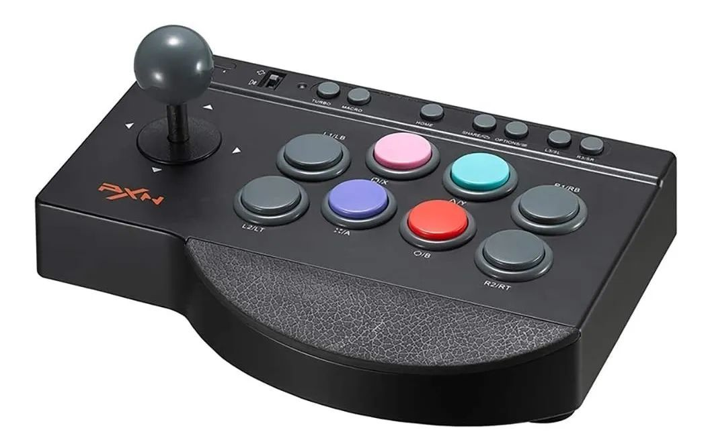
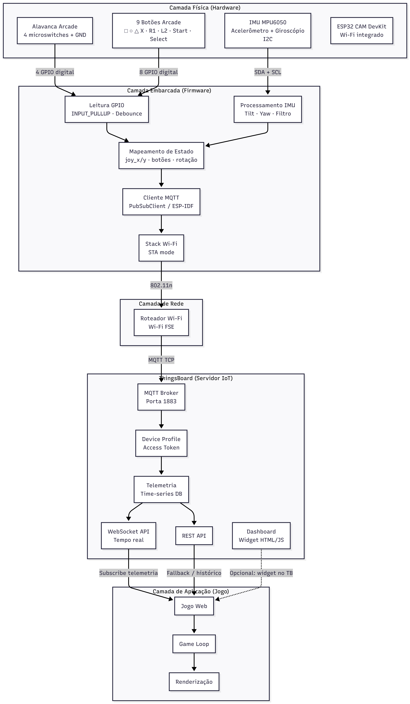

# Análise e Recriação Conceitual de um Controle Arcade

**Trabalho 2 - 2026-1**

## Integrantes do Grupo

| Nome Completo | Matrícula |
| :--- | :--- |
| Carlos Eduardo de Sousa Paz | 222022064 |
| João Pedro Silva Sousa | 222006258 |
| Leonardo de Melo Lima | 222037700 |
| Marcelo Araujo dos Santos | 160035481 |

---

## 1. Descrição do Produto Selecionado: Controle Arcade

<p align="center">
  
</p>

<p align="center"><em>Figura 1: Controle arcade fight stick utilizado como referência do produto</em></p>

O controle arcade é um dispositivo de entrada projetado para reproduzir, em formato de painel físico, as funções essenciais de um **joystick convencional** utilizado em videogames. Diferente de um gamepad doméstico — como o DualShock 3 analisado no [projeto de referência da disciplina](https://gitlab.com/fse_fga/trabalhos-semestres-anteriores/trabalhos-2025_2/trabalho-2-2025-2/-/tree/main/PS3) —, o controle arcade prioriza botões de grande área, uma alavanca mecânica de quatro direções e um layout voltado para jogos de ação, nave espacial e títulos clássicos de fliperama.

Neste projeto, o controle arcade replica de forma conceitual as entradas de um joystick tradicional: **direcionamento**, **botões de ação**, **botões auxiliares** e **detecção de inclinação/orientação**, substituindo a conectividade Bluetooth do controle comercial por comunicação **Wi-Fi** com a plataforma **ThingsBoard**, onde um jogo web consome a telemetria em tempo real.

### 1.1. Funções Principais, Público-Alvo e Contexto de Uso

O controle arcade é voltado a jogadores que buscam uma experiência tátil e imersiva, semelhante à de máquinas de fliperama. Seu público-alvo inclui entusiastas de retrogaming, estudantes de sistemas embarcados e usuários interessados em interfaces físicas conectadas à Internet das Coisas (IoT).

No contexto deste trabalho, o dispositivo atua como **controlador remoto** de um jogo hospedado em dashboard web no ThingsBoard: o jogador manipula a alavanca para movimentar a nave, pressiona os botões de ação para executar comandos no jogo e inclina o controle para alterar a orientação da nave, simulando o comportamento de sensores de movimento presentes em controles modernos.

### 1.2. Componentes e Sensores Utilizados

O controle arcade proposto combina entradas digitais, um sensor inercial e um microcontrolador embarcado:

* **Alavanca arcade (joystick digital):** Mecanismo com quatro microchaves (Up, Down, Left, Right) acionadas pelo deslocamento da haste. Cada direção é lida como sinal digital pelo microcontrolador, equivalente funcional ao D-pad ou ao stick digital de um joystick convencional.

* **Botões de ação digitais:** Oito botões arcade de acionamento mecânico, mapeados para as funções □ (Quadrado), ○ (Círculo), △ (Triângulo), X, R1, L2, Start e Select — reproduzindo o layout de ações principais de um controle de videogame em formato arcade.

* **Unidade de Medição Inertial (IMU):** Sensor com acelerômetro e giroscópio (ex.: MPU6050), disponível na [lista de sensores da disciplina](https://gitlab.com/fse_fga/trabalhos-2026_1/trabalho-2-2026-1/-/blob/main/Lista_de_Sensores.md), utilizado para detectar inclinação e rotação do controle, permitindo que a nave no jogo responda ao movimento físico do dispositivo.

* **Microcontrolador ESP32:** Responsável pela leitura de todas as entradas, processamento dos sinais e publicação dos dados via Wi-Fi.

### 1.3. Tecnologias de Comunicação e Controle Embarcadas

A comunicação do controle é realizada exclusivamente via **Wi-Fi**, utilizando o protocolo **MQTT** para envio de telemetria à plataforma **ThingsBoard**. Essa abordagem substitui o Bluetooth empregado no projeto de referência do DualShock 3, adequando-se ao ecossistema IoT exigido pelo trabalho.

O jogo web, executado como widget ou aplicação conectada ao ThingsBoard, recebe os dados de telemetria via **WebSocket** ou **REST API**, atualizando em tempo real a posição, rotação e ações da nave controlada pelo jogador.

---

## 2. Análise Técnica do Funcionamento

### 2.1. Principais Módulos do Sistema

- **Sensores de entrada:**
  - **Alavanca arcade:** Quatro microchaves independentes geram sinais digitais (LOW/HIGH) conforme a direção pressionada. Com `INPUT_PULLUP` no ESP32, o estado repouso é HIGH e o acionamento resulta em LOW.
  - **Botões arcade:** Cada botão possui dois terminais; um conectado a um GPIO do ESP32 e outro ao GND. O firmware aplica debounce (~30 ms) para evitar leituras espúrias.
  - **IMU (MPU6050):** Comunicação I2C (SDA/SCL). O acelerômetro mede inclinação em relação à gravidade; o giroscópio mede velocidade angular nos eixos de rotação. Um filtro complementar combina ambas as leituras para estimar a orientação (`ship_yaw`) enviada ao jogo.

- **Controle:**
  - **ESP32:** Microcontrolador central que executa o firmware embarcado. Realiza leitura periódica dos GPIOs e do IMU (~20 Hz), monta o payload JSON de telemetria e publica via MQTT.

- **Conectividade:**
  - **Wi-Fi (STA):** O ESP32 conecta-se à rede local e autentica-se no broker MQTT do ThingsBoard mediante Access Token do device cadastrado.
  - **MQTT:** Telemetria publicada no tópico `v1/devices/me/telemetry` com campos como `joy_x`, `joy_y`, `btn_x`, `btn_square`, `ship_yaw`, entre outros.

- **Aplicação (ThingsBoard + Jogo):**
  - **ThingsBoard:** Armazena telemetria em time-series e disponibiliza dados em tempo real via WebSocket.
  - **Jogo web:** Canvas ou framework (Phaser, p5.js) consome a telemetria e executa o game loop (~60 FPS), movendo e rotacionando a nave conforme as entradas físicas.

### 2.2. Identificação de Tecnologias Críticas

- **Leitura digital de entradas:** Botões e alavanca operam como chaves digitais. A principal preocupação é o debounce e a correta alocação de GPIOs (evitando pinos reservados à flash interna, GPIO 6–11).

- **Processamento de IMU:** Deriva do giroscópio e ruído do acelerômetro exigem filtragem em software. A calibração do eixo de rotação é necessária para que a inclinação lateral do controle corresponda à rotação esperada da nave.

- **Comunicação Wi-Fi + MQTT:** Latência de rede e reconexão automática são fatores críticos. O firmware deve tratar quedas de conexão e republicar telemetria apenas quando houver mudança de estado ou timeout periódico (~50 ms).

- **Integração ThingsBoard ↔ Jogo:** O widget ou página web deve assinar a telemetria do device correto e mapear cada campo JSON para ações no game loop (movimento, rotação, disparo, pausa).

---

## 3. Proposta de Implementação com ESP32 e ThingsBoard

### 3.1. Descrição Conceitual da Implementação

O projeto tem como objetivo implementar um controle arcade funcional utilizando microcontrolador ESP32 e sensores disponibilizados na disciplina, reproduzindo as principais funcionalidades de um joystick convencional em formato de painel físico. O sistema é composto por uma ESP32 que lê os estados da alavanca, dos botões físicos e do sensor de movimento (acelerômetro e giroscópio).

Os sinais captados são convertidos em telemetria digital, tratados pelo firmware da ESP32 e enviados via **Wi-Fi (MQTT)** para o **ThingsBoard**. Um jogo web conectado à plataforma consome esses dados em tempo real, controlando a nave do jogador.

As funcionalidades implementadas seguem abaixo:

#### Controlar comportamentos

A ESP32 gerencia o comportamento de todas as entradas (alavanca, botões e IMU), processa os sinais e mantém a comunicação Wi-Fi/MQTT com o ThingsBoard.

#### Captar sinais de botões e alavanca

Cada botão e direção da alavanca é conectado a um GPIO configurado como `INPUT_PULLUP`. No repouso, o pino permanece em HIGH; ao pressionar, o circuito fecha para GND e o pino vai a LOW. O firmware detecta a transição, aplica debounce e atualiza o estado correspondente no payload de telemetria.

Entradas mapeadas: □, ○, △, X, R1, L2, Start, Select e as quatro direções da alavanca (Up, Down, Left, Right).

#### Detectar movimento e orientação

A detecção de inclinação e rotação é realizada pela IMU (acelerômetro + giroscópio). Inclinar o controle lateralmente altera o valor de `ship_yaw` enviado ao ThingsBoard, fazendo a nave girar no jogo de acordo com o movimento físico do jogador.

#### Comunicação Wi-Fi com ThingsBoard

A ESP32 conecta-se à rede Wi-Fi e publica telemetria JSON no broker MQTT do ThingsBoard. O jogo web assina os dados via WebSocket e atualiza o estado do jogador a cada frame.

Exemplo de payload de telemetria:

```json
{
  "joy_x": 1,
  "joy_y": 0,
  "btn_x": false,
  "btn_square": false,
  "btn_circle": false,
  "btn_triangle": false,
  "btn_r1": false,
  "btn_l2": false,
  "btn_start": false,
  "btn_select": false,
  "ship_yaw": -15.3,
  "tilt_roll": -12.1
}
```

### 3.2. Diagrama Conceitual do Sistema (Proposta com ESP32)

A proposta deste diagrama é demonstrar, de maneira hierárquica, a arquitetura em camadas do sistema e o fluxo de dados desde o hardware físico até o jogo web. O microcontrolador ESP32 ocupa a camada embarcada central, intermediando a leitura dos componentes de entrada e a publicação de telemetria na plataforma ThingsBoard.

<p align="center">
  
</p>

<p align="center"><em>Figura 2: Diagrama conceitual de arquitetura em camadas do controle arcade com ESP32 e ThingsBoard</em></p>

### 3.3. Limitações e Desafios Esperados

#### Limitações

- **GPIOs limitados:** Oito botões, quatro direções da alavanca e dois pinos I2C consomem cerca de 14 GPIOs. Embora a ESP32 disponha de pinos suficientes, GPIO 6–11 (ligados à flash interna) devem ser evitados.
- **Entradas exclusivamente digitais:** Diferente do DualShock 3 de referência, botões e alavanca não possuem sensibilidade à pressão — todas as entradas são binárias (pressionado/solto).
- **Latência de rede:** A cadeia Wi-Fi → MQTT → ThingsBoard → WebSocket → jogo introduz latência adicional (~50–200 ms) em relação a um controle com conexão direta (Bluetooth/USB).
- **Calibração da IMU:** Deriva do giroscópio e interferências exigem calibração periódica e filtragem em software para rotação estável da nave.
- **Dependência de infraestrutura:** O controle requer rede Wi-Fi funcional e instância ThingsBoard acessível; quedas de conexão interrompem temporariamente o controle do jogo.

#### Desafios Esperados

- Integrar hardware arcade (alavanca, botões e IMU) com firmware embarcado e plataforma IoT em um fluxo ponta a ponta funcional.
- Desenvolver ou adaptar um jogo web capaz de consumir telemetria ThingsBoard em tempo real via WebSocket.
- Sincronizar taxa de publicação MQTT com o game loop sem perda perceptível de responsividade.
- Montagem física do painel arcade com fiação organizada e fixação adequada dos componentes.

---

<!--
## 4. Mapeamento de Controles

| Entrada Física | Telemetria | Ação no Jogo |
| :--- | :--- | :--- |
| Alavanca ↑ ↓ ← → | `joy_x`, `joy_y` (−1, 0, 1) | Movimentar a nave |
| Inclinar controle (IMU) | `ship_yaw`, `tilt_roll` | Rotacionar a nave |
| Botão X | `btn_x` | Disparo / ação principal |
| Botão △ | `btn_triangle` | Escudo / ação secundária |
| Botão □ | `btn_square` | Bomba / especial |
| Botão ○ | `btn_circle` | Boost |
| Botão R1 | `btn_r1` | Boost alternativo |
| Botão L2 | `btn_l2` | Freio / recuo |
| Botão Start | `btn_start` | Pausar |
| Botão Select | `btn_select` | Menu / reiniciar |

---

## 5. Pinagem Proposta (ESP32)

| Componente | GPIO |
| :--- | :--- |
| Alavanca UP | 13 |
| Alavanca DOWN | 12 |
| Alavanca LEFT | 14 |
| Alavanca RIGHT | 27 |
| Botão □ (Quadrado) | 25 |
| Botão ○ (Círculo) | 26 |
| Botão △ (Triângulo) | 32 |
| Botão X | 33 |
| Botão R1 | 18 |
| Botão L2 | 19 |
| Botão Start | 21 |
| Botão Select | 22 |
| IMU SDA | 4 |
| IMU SCL | 15 |

---
-->

## 6. Referências

> Fundamentos de Sistemas Embarcados (FGA-UnB). **Trabalho 2 — 2025-2: Controle DualShock 3 (PS3)**. Disponível em: [https://gitlab.com/fse_fga/trabalhos-semestres-anteriores/trabalhos-2025_2/trabalho-2-2025-2/-/tree/main/PS3](https://gitlab.com/fse_fga/trabalhos-semestres-anteriores/trabalhos-2025_2/trabalho-2-2025-2/-/tree/main/PS3). Acesso em: 10 jun. 2026.

> Fundamentos de Sistemas Embarcados (FGA-UnB). **Lista de Sensores — Trabalho 2, 2026-1**. Disponível em: [https://gitlab.com/fse_fga/trabalhos-2026_1/trabalho-2-2026-1/-/blob/main/Lista_de_Sensores.md](https://gitlab.com/fse_fga/trabalhos-2026_1/trabalho-2-2026-1/-/blob/main/Lista_de_Sensores.md). Acesso em: 10 jun. 2026.

> THINGSBOARD. **Documentation — MQTT API**. Disponível em: [https://thingsboard.io/docs/reference/mqtt-api/](https://thingsboard.io/docs/reference/mqtt-api/). Acesso em: 10 jun. 2026.
