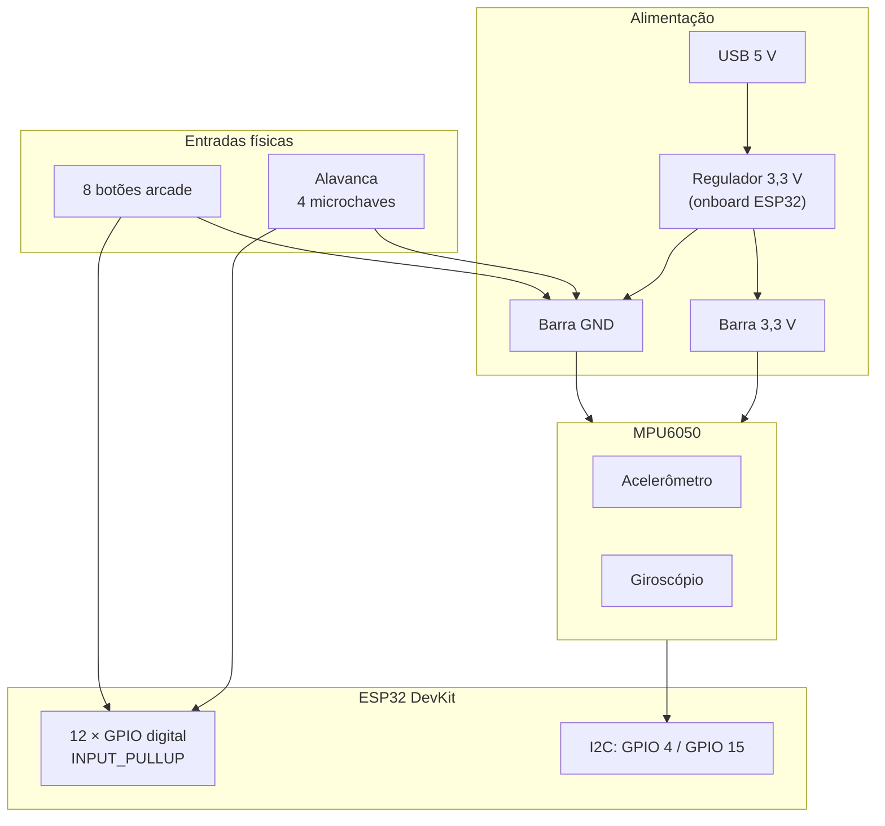
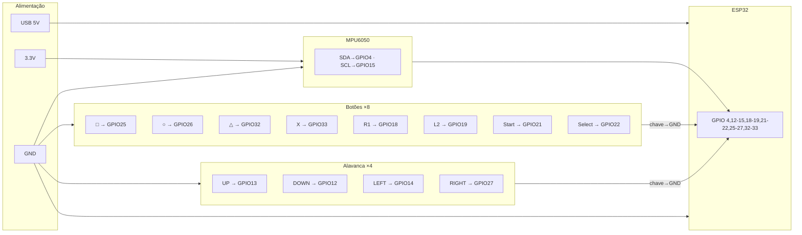

# Modelo do Circuito Eletrônico — Controle Arcade

Este documento descreve o circuito elétrico do protótipo: alimentação, entradas digitais (alavanca e botões), sensor IMU e barramento de referência comum (GND).

---

## 1. Visão Geral

O sistema é composto por quatro blocos elétricos principais:

| Bloco | Função | Interface com ESP32 |
| :--- | :--- | :--- |
| Alimentação | Regula tensão e fornece 3,3 V / GND | USB → regulador onboard |
| Alavanca arcade | 4 microchaves SPST (UP/DOWN/LEFT/RIGHT) | 4 GPIO digitais + GND comum |
| Botões arcade | 8 chaves SPST mecânicas | 8 GPIO digitais + GND |
| MPU6050 | Acelerômetro + giroscópio | I2C (SDA/SCL) + 3,3 V |



---

## 2. Alimentação

A ESP32 DevKit é alimentada via **USB (5 V)**. O regulador linear integrado na placa reduz a tensão para **3,3 V**, que alimenta o microcontrolador e o MPU6050.

```
  USB (5 V) ──► [Regulador AMS1117 / equivalente] ──► 3,3 V ──┬── ESP32 (VIN/3V3)
                                                               └── MPU6050 VCC

  GND comum ───────────────────────────────────────────────────┬── ESP32 GND
                                                                ├── Alavanca GND
                                                                ├── Botões GND
                                                                └── MPU6050 GND
```

| Ponto | Tensão | Observação |
| :--- | :--- | :--- |
| Entrada USB | 5 V DC | Fonte padrão (PC, power bank ou adaptador) |
| Barramento 3,3 V | 3,3 V | Saída do regulador onboard |
| Corrente estimada | ~150–250 mA | ESP32 ativo + Wi-Fi + MPU6050 |
| MPU6050 | **3,3 V obrigatório** | Não alimentar em 5 V (lógica incompatível) |

> Todos os componentes compartilham o mesmo **GND** (referência comum). A fiação interna da case deve usar um barramento ou trilha GND central para reduzir ruído.

---

## 3. Célula de Entrada Digital (Botão / Microchave)

Cada botão e cada direção da alavanca usa o **mesmo circuito elétrico**: uma chave SPST que, ao fechar, conecta o GPIO ao GND.

O pull-up é o **resistor interno do ESP32** (`INPUT_PULLUP`, ~45 kΩ para 3,3 V), dispensando resistores externos.

### 3.1. Esquemático de uma célula

```
                         ESP32
                      ┌──────────┐
         3,3 V ───────┤ Rpu int. │  (ativado por INPUT_PULLUP no firmware)
                      │    │     │
                      │  GPIO n  ├──────┬─── Terminal 1 (botão / microchave)
                      └──────────┘      │
                                        │
                                   [  SW  ]   ← chave mecânica SPST
                                        │
                                       GND ◄── Terminal 2
```

### 3.2. Estados lógicos

| Condição física | Tensão no GPIO | Leitura digital |
| :--- | :--- | :--- |
| Repouso (chave aberta) | ~3,3 V (HIGH) | `1` / `false` (não pressionado) |
| Acionado (chave fechada) | ~0 V (LOW) | `0` / `true` (pressionado) |

### 3.3. Replicação no hardware

- **Alavanca:** 4 células idênticas (UP, DOWN, LEFT, RIGHT).
- **Botões:** 8 células idênticas (□, ○, △, X, R1, L2, Start, Select).
- **Total:** 12 entradas digitais independentes.

O terminal **GND** de todas as chaves pode ser unido em um **barramento GND comum** (fio único até o pino GND da ESP32).

---

## 4. Alavanca Arcade (Joystick Digital)

A alavanca mecânica contém **quatro microchaves independentes**. Cada direção é um circuito SPST separado — não há saída analógica.

```
                    Barramento GND comum
                           │
         ┌─────────────────┼─────────────────┐
         │                 │                 │
    [SW UP]           [SW DOWN]         [SW LEFT]         [SW RIGHT]
         │                 │                 │                 │
      GPIO 13           GPIO 12           GPIO 14           GPIO 27
         │                 │                 │                 │
         └─────────────────┴─────────────────┴─────────────────┘
                                    │
                              ESP32 (pull-ups internos)
```

| Direção | GPIO | Terminal livre | Terminal comum |
| :--- | :--- | :--- | :--- |
| UP | 13 | GPIO 13 | GND |
| DOWN | 12 | GPIO 12 | GND |
| LEFT | 14 | GPIO 14 | GND |
| RIGHT | 27 | GPIO 27 | GND |

> É possível acionar duas direções simultaneamente (ex.: UP + RIGHT = diagonal), pois cada microchave é independente.

---

## 5. Botões Arcade

Os oito botões seguem a mesma topologia da célula digital da seção 3.

```
  GPIO 25 (□)  ──[SW]── GND
  GPIO 26 (○)  ──[SW]── GND
  GPIO 32 (△)  ──[SW]── GND
  GPIO 33 (X)  ──[SW]── GND
  GPIO 18 (R1) ──[SW]── GND
  GPIO 19 (L2) ──[SW]── GND
  GPIO 21 (Start) ──[SW]── GND
  GPIO 22 (Select)──[SW]── GND
```

| Botão | Função | GPIO |
| :--- | :--- | :--- |
| □ (Square) | Bomba / especial | 25 |
| ○ (Circle) | Boost | 26 |
| △ (Triangle) | Escudo | 32 |
| X | Disparo principal | 33 |
| R1 | Boost alternativo | 18 |
| L2 | Freio / recuo | 19 |
| Start | Pausar | 21 |
| Select | Menu / reiniciar | 22 |

---

## 6. Sensor IMU — MPU6050 (I2C)

O MPU6050 comunica-se com a ESP32 via barramento **I2C** (endereço padrão `0x68` ou `0x69`, conforme pino AD0).

### 6.1. Esquemático de conexão

```
  3,3 V ──┬──────────────────────────── VCC (MPU6050)
          │
          ├──[ Rpu 4,7 kΩ ]──┬──────── SDA ────── GPIO 4
          │                  │         (I2C Data)
          │              [MPU6050]
          │                  │
          ├──[ Rpu 4,7 kΩ ]──┴──────── SCL ────── GPIO 15
          │                            (I2C Clock)
          │
  GND ────┴──────────────────────────── GND (MPU6050)
```

### 6.2. Pinagem

| Sinal MPU6050 | Conexão ESP32 | Observação |
| :--- | :--- | :--- |
| VCC | 3,3 V | **Nunca 5 V** |
| GND | GND | Referência comum |
| SDA | GPIO 4 | Dados I2C |
| SCL | GPIO 15 | Clock I2C |
| AD0 | GND ou 3,3 V | Define endereço I2C (opcional) |

### 6.3. Resistores de pull-up I2C

O barramento I2C exige pull-ups em SDA e SCL para 3,3 V (tipicamente **4,7 kΩ** cada).

- Módulos **GY-521** costumam trazer esses resistores na placa breakout — nesse caso, **não** é necessário adicionar externos.
- Se o módulo não tiver pull-ups, instalar um resistor de 4,7 kΩ entre SDA↔3,3 V e outro entre SCL↔3,3 V.

---

## 7. Mapa Completo de GPIOs

```
                    ┌─────────────────────────────────┐
                    │         ESP32 DevKit            │
                    │                                 │
  Alavanca UP    ───┤ GPIO 13                         │
  Alavanca DOWN  ───┤ GPIO 12                         │
  Alavanca LEFT  ───┤ GPIO 14                         │
  Alavanca RIGHT ───┤ GPIO 27                         │
                    │                                 │
  Botão □        ───┤ GPIO 25                         │
  Botão ○        ───┤ GPIO 26                         │
  Botão △        ───┤ GPIO 32                         │
  Botão X        ───┤ GPIO 33                         │
  Botão R1       ───┤ GPIO 18                         │
  Botão L2       ───┤ GPIO 19                         │
  Botão Start    ───┤ GPIO 21                         │
  Botão Select   ───┤ GPIO 22                         │
                    │                                 │
  MPU6050 SDA    ───┤ GPIO 4                          │
  MPU6050 SCL    ───┤ GPIO 15                         │
                    │                                 │
  GND (comum)    ───┤ GND  ◄── alavanca + botões + IMU
  3,3 V          ───┤ 3V3  ◄── MPU6050 VCC            │
                    └─────────────────────────────────┘
```

### GPIOs a evitar

| GPIO | Motivo |
| :--- | :--- |
| 6 – 11 | Conectados à flash SPI interna |
| 0, 2, 5, 15 (strap) | Podem afetar boot; usar com cautela |
| 34 – 39 | Somente entrada, **sem** pull-up interno |

Os pinos escolhidos (12, 13, 14, 18, 19, 21, 22, 25, 26, 27, 32, 33, 4, 15) são adequados para entradas digitais com pull-up interno.

---

## 8. Diagrama Elétrico Consolidado



---

## 9. Lista de Materiais (BOM) — Parte Elétrica

| Qtd | Componente | Especificação |
| :--- | :--- | :--- |
| 1 | ESP32 DevKit | Wi-Fi integrado, alimentação USB |
| 1 | Alavanca arcade | 4 microchaves, comum GND |
| 8 | Botão arcade | SPST, 2 terminais |
| 1 | MPU6050 (GY-521) | Módulo I2C, 3,3 V |
| 1 | Cabo USB | Alimentação e programação |
| — | Fios / jumpers | Conexão GPIO ↔ componentes |
| 0–2 | Resistor 4,7 kΩ | Somente se o módulo MPU6050 não tiver pull-ups I2C |

**Não necessários:** resistores de pull-up externos para botões/alavanca (pull-up interno do ESP32); capacitor de desacoplamento extra (já presente nas placas breakout); fonte externa separada (USB é suficiente).

---

## 10. Considerações de Montagem

1. **GND em estrela ou barramento:** Concentre todos os retornos GND em um ponto próximo ao pino GND da ESP32 para evitar loops de terra.
2. **Fios curtos no I2C:** SDA e SCL devem ter comprimento similar e ficar afastados de fios de alimentação ruidosos.
3. **Debounce em software:** O firmware aplica ~30 ms de debounce; não é obrigatório capacitor hardware nos botões.
4. **MPU6050 fixo na case:** Posição e orientação mecânica afetam a calibração de `ship_yaw` e `tilt_roll`.
5. **Alimentação estável:** Quedas de tensão durante picos de transmissão Wi-Fi podem causar reset; usar cabo USB de boa qualidade.

---

## Referências internas

- Pinagem detalhada: [`02-pinagem-hardware.txt`](02-pinagem-hardware.txt)
- Arquitetura em camadas: [`01-arquitetura-camadas.txt`](01-arquitetura-camadas.txt)
- README do projeto: [`../README.md`](../README.md)
